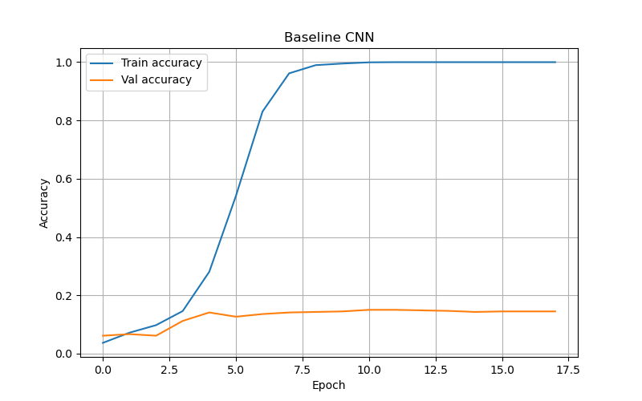

# 🐾 Oxford-IIIT Pet Classification

Classification of 37 cat and dog breeds using CNN (PyTorch).  
**Dataset:** [Oxford-IIIT Pet Dataset](https://www.robots.ox.ac.uk/~vgg/data/pets/) — 7,349 images, 37 breeds

---

## Experiments

| # | Model | Key Changes | Test Accuracy |
|---|-------|-------------|:-------------:|
| 0 | Baseline CNN | 3x Conv-ReLU-Pool, Adam | 13.3% |
| 1 | BatchNorm + Deeper | 4 blocks, BatchNorm after each Conv | 22.4% |
| 2 | Dropout + Augmentation | Dropout(0.5), flip/rotate/colorjitter | 22.5% |
| 3 | Exp1 + Aug + SGD | SGD momentum=0.9, augmentation | 29.0% |
| 4 | Deep BN + GAP | 5 blocks, BatchNorm, Global Average Pooling | 32.3% |
| 5 | **GeLU + AdamW + Cosine LR** | GeLU activation, AdamW, Cosine LR scheduler, label smoothing | **46.2%** |

---

## Experiment Progression

### Exp0 → Exp1: Baseline gave only 13.3%
The baseline had no BatchNorm — training was unstable and the network struggled to learn. Adding BatchNorm after every Conv layer and one extra block pushed accuracy to **22.4%**.

---

### Exp1 → Exp2: BatchNorm helped, but the model was overfitting
Train accuracy kept growing while val stagnated. Added Dropout(0.5) and data augmentation to reduce overfitting — but the result was nearly identical (**22.5%**). Dropout alone was not enough.

---

### Exp2 → Exp3: Switched optimizer to SGD with momentum
Adam was converging too fast to a poor local minimum. SGD with momentum=0.9 combined with augmentation gave a visible jump to **29.0%** — the model generalized better.

---

### Exp3 → Exp4: Replaced Flatten with Global Average Pooling
The large fully-connected layer after Flatten caused overfitting. Replacing it with Global Average Pooling (GAP) made the model 10× smaller and improved accuracy to **32.3%**.

---

### Exp4 → Exp5: Replaced ReLU with GeLU and switched to AdamW + Cosine LR
Exp4 showed a gap between train and val — the model was memorizing. To improve generalization: switched activation to **GeLU** (smoother than ReLU), used **AdamW** (correct weight decay), added a **Cosine LR scheduler** so the learning rate decreases gradually, and **label smoothing** to prevent overconfidence. Result: **46.2%** — a +13.9% improvement.

**Exp5 — Best model (46.2%):**

---
 
## Best Model — Exp5 (46.2%)

**Easiest breeds:**

| Breed | F1-score |
|-------|:--------:|
| Egyptian Mau | 0.70 |
| Bengal | 0.65 |
| Japanese Chin | 0.64 |
| Samoyed | 0.64 |
| Bombay | 0.62 |

**Hardest breeds:**

| Breed | F1-score |
|-------|:--------:|
| Chihuahua | 0.11 |
| American Pit Bull Terrier | 0.16 |
| Staffordshire Bull Terrier | 0.16 |
| Beagle | 0.31 |
| Havanese | 0.32 |
 
---

## Conclusions

- **BatchNorm** stabilizes training and speeds up convergence (+9% vs baseline)
- **Global Average Pooling** reduces overfitting compared to Flatten
- **SGD with momentum** outperformed Adam when combined with augmentation
- **GeLU + AdamW + Cosine LR** gave the biggest improvement (+13.9% vs Exp4)
- Visually similar breeds (Bulldog / Pit Bull / Staffordshire) are the hardest to classify